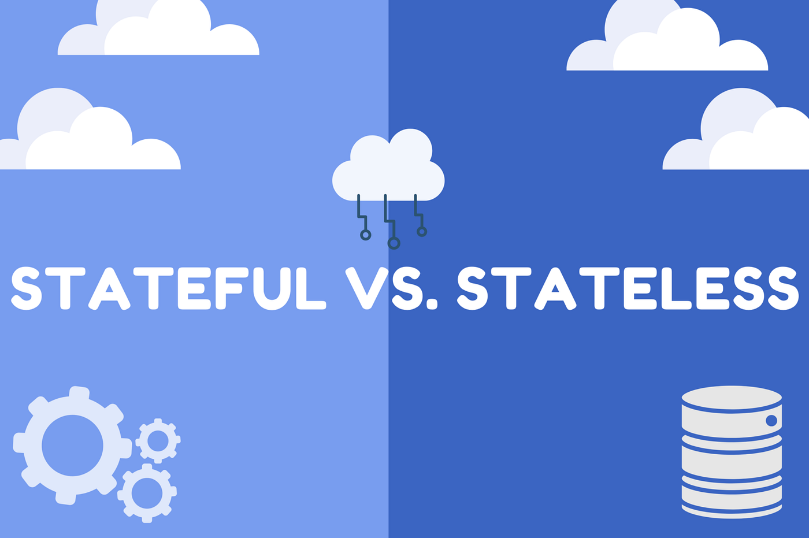

# **Stateless vs Stateful Sets:**

### **`Stateless Applications:`**

A stateless application does not retain any session information or data about its users between different reqeusts. Each request from a client to the server is treated as an independent transaction, unrelated to any previous requests.

#### **Characteristics:**

-   Each requests is self-contained.
-   No information is stored about the user's previous interactions.
-   Typically simpler to scale.
-   More resilient to failures, as each reqeust is independent.
-   Examples: RESTful web services, simple web pages.

### **`Stateful Applications`:**

A stateful application retains session information or data about its users between different requests. This means that the server can remember the state of interaction with the client across multiple reqeusts.

#### **Characteristics:**

-   Each reqeust is dependent on the previous reqeusts.
-   Session information is stored either on the server or client side.
-   Can provide more personalized and interactive user experiences.
-   More complex to scale and manage due to the need for maintaining state.
-   Example: online banking, shopping carts in e-commerce websites, chat applications

### **Differences:**

|     | Stateless Sets | Stateful Set |
|-----| ---------------| -------------|
| Session Management | No Session Information is stored. Each Request is independent| Session Information is stored. Each request is dependent on the previous interactions|
| Scalability | Easier to scale horizontally since no session data needs to be synchronized scross servers. | More Challenging to scale because the session state needs to be maintained and possibly shared across servers.|
| Resilience| More resilient as each request is independent. Server failure does not affect user sessions. | Less resilient to server failures since session state might be lost or need to be transferred.|
| Complexity | Simpler to design and implement| More complex due to the need for session management and state synchronization|
|Use Cases| Suitable for applications where the interaction with the server is brief and each request can be handled independently (ex: REST APIs, basic web pages)| Suitable for applications requiring a continuous interaction between the client and server(Ex: e-commerce websites with shopping carts, user login sessions)

