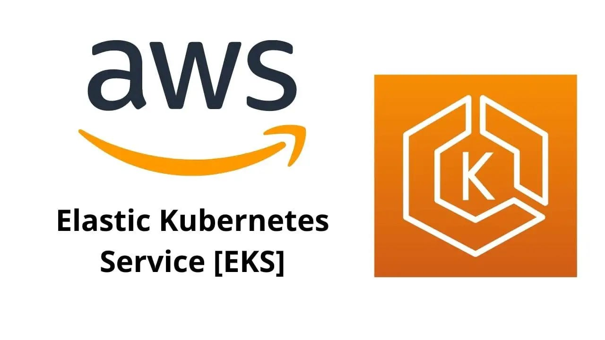

# Amazon-EKS(Elastic Kubernetes Service)

### **What is Amazon EKS?**

- Amazon Elastic Kubernetes Service (Amazon EKS) is a managed service that eliminates the need to install, operate and maintain your own kubernetes control plane on Amazon Web Services (AWS).
- Kubernetes is an open-source system that automates the management, scaling and deployment of containerized applications.

### **Features of Amazon EKS:**
--------------------------------

- Following are key features of Amazon EKS:

### **Secure Networking and Authentication:**

- Amazon EKS integrates your Kubernetes workloads with AWS networking and security services.
- It also integrates with AWS Identity and Access Management (IAM) to provide autnetication for your kubernetes clusters.

### **Easy Cluster Scaling:**

- Amazon EKS enables you to scale your kubernetes clusters up and down easily based on the deamnd of your workloads.
- Amazon EKS supports horizontal Pod autoscaling based on CPU or custom metrics, and cluster autoscaling based on the demand of the entire workload.

### **Managed Kubernetes experience:**

- You can make changes to your kubernetes clusters using eksctl, AWS Management Console, AWS CLI, the API, kubectl and Terraform.

### **High Availability:**

- Amazon EKS provides high availability for your control plance across multiple Availability Zones.

### **Integration with AWS Services:**

- Amazon EKS integrates with other AWS Services, providing a comprehensive platform for deploying and managing your containerized applications.
- You can also more easily ytoubleshoot your kubernetes workloads with various observability tools.

Following diagram shows a basic flow of running Amazon EKS in the cloud.

