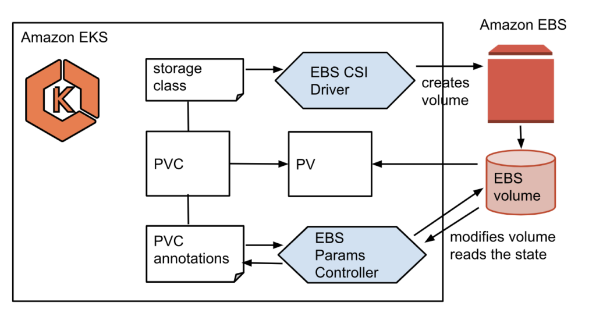
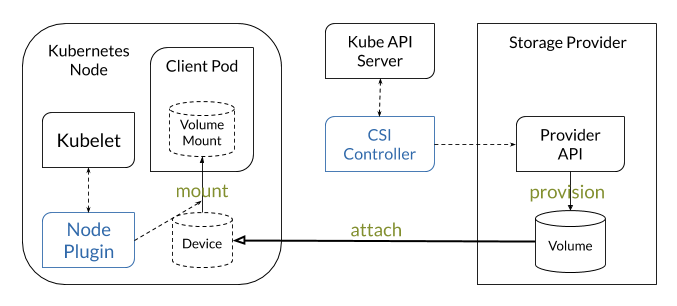

# **Storage**

Storage on EKS will provide a high level overview on how to integrate AWS Storage Service with EKS Cluser.

Following are the AWS Storage Services we'll utilize and integrate with EKS.

- **`Amazon Elastic Block Store (Supports EC2 only)`:**

    A Block storage service that provides direct access from EC2 instances and containers to a dedicated storage volume designed for both througput and transaction-intensive workloads at any scale.

- **`Amazon Elastic File System (Supports fargate and EC2)`:**

    a fully managed, scalable and elastic file system well suited for big data analytics, web serving and content management, application development and testing, media and entertainment workflows, database backups, and container storage. EFS store our data redundantly across multiple Availability Zones (AZ) and offers low latency access from Kubernetes pods irrespective of the AZ in which they are running.

- **`Amazon FSx for NetApp ONTAP(Supports EC2 Only)`:**

    Fully managed shared storage built on NetApp's popular ONTAP file system. FSx for netapp ONTAP stores our data redundantly across multiple Availability Zones (AZ) and offers low latency access from Kubernetes pods irrespective of the AZ in which they are running.

- **`FSx for Lustre(Supports EC2 only)`:**

    a fully managed, high-performance file system optimized for workloads such as machine learning, high-performance computing, video processing, financial modeling, electornic design automation and analytics. With FSx for luster, you can quickly create a high-performance file system linked to our S3 data repository and transparently access S3 objects as files.

**Following are the Kubernetes Storage Concepts:**

-   **`Volumes:`**

    -   On-disk files in a container are ephermeral, which prsents some problems for non-trivial applications when running in containers. 
    -   One problem is the loss of files when a container crashes. 
    -   The kubelet restarts the container but with a clean state.
    -   A second problem occurs when sharing files between containers running together in a Pod.
    - The Kubernetes volume abstraction solves both of these problems. Familiarity with Pods is suggested.

- **`Ephemeral Volumes:`**

    -   EVs are designed for these use cases. Because volumes follow the Pod's lifetime and get created and deleted along with the Pod, Pods can be stopped and restarted without being limited to where some persistent volume is available.

- **`Persisitent Volumes(PV):`**

    -   PV is a peice of storage in a cluster that has been provisioned by an administrator or dynamically provisioned using Storage Classes.
    -   It's a resource in the cluster just like a node is a cluster resource.
    -   PVs are volume plugins like volumes, but have a lifecycle independent of any individual Pod that uses the PV.
    -   This API object captures the details of the implementation of the Storage, be that NFS, iSCSI or a Cloud-Provider-Specific storage system

- **`Persistent Volume Claim(PVC):`**

    -   PVC is a request for storage by a user.
    -   It's similar to a Pod.
    -   Pods consume node resources an dPVCs consume PV resources.
    -   Pods can request specififc levels of resources (CPu and Memory).
    -   Claims can request specific size and access modes.

-   **`Storage Classess:`**

    -   Storage Classes provides a way for administrators to describe the "classes" of storage they offer.
    -   Differnet classes might map to quality-of-service levels, or to backup policies, or to arbitary policies determined by cluster administrators.
    -   Kubernetes itself is unopinionated about what classes represent.
    -   This concept is sometimes called "profiles" in other storage systems.

- **`Dynamic Volume Provisioning:`**

    -   Dynamic Volume Provisioning allows storage volumes to be created on-demand.
    -   Without dynamic provisioning, cluster administrators have to manually make calls to their cloud or storage provider to create new storage volumes, and then create PersistenVolume objects to represent them in Kubernetes.
    -   The dynamic provisioning feature eliminates the need for cluster administrators to pre-provision storage.
    -   Instead, it automatically provisions storage when it is requested by users.